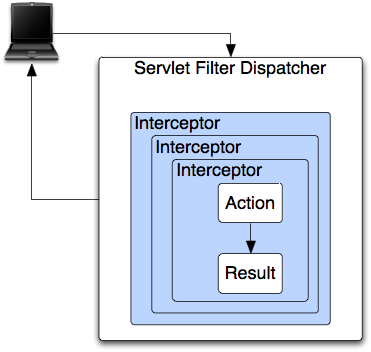

# Nutshell

 The framework documentation is written for active web developers and assumes a working knowledge about how Java web applications are built\. For more about the underlying nuts and bolts, see the [Key Technologies Primer](http://struts\.apache\.org/primer\.html)^[http://struts\.apache\.org/primer\.html]\.

> 

####Apache Struts 2 Architecture in a Nutshell####

1. The web browser requests a resource (/mypage.action, /reports/myreport.pdf, et cetera)\
2. The Filter Dispatcher looks at the request and determines the appropriate Action\
3. The Interceptors automatically apply common functionality to the request, like workflow, validation, and file upload handling\
4. The Action method executes, usually storing and/or retrieving information from a database\
5. The Result renders the output to the browser, be it HTML, images, PDF, or something else\

|
|------------------------------------------------------------------------------------------------------------------------------|-------------------------------------------------------------------------------------------------------------------------------------------------------------------------------------------------------------------------------------------------------------------------------------------------------------------------------------------------------------------------------------------------------------------------------------------------------------------------------------------------------------------------|

####Struts Tags in a nutshell####

The Struts Tags help you create rich web applications with a minimum of coding\. Often, much of the coding effort in a web application goes into the pages\. The Struts Tags reduce effort by reducing code\.

~~~~~~~

<% User user = ... %>
<form action="Profile_update.action" method="post">
    <table>
        <tr>
            <td align="right"><label>First name:</label></td>
            <td><input type="text" name="user.firstname" value="<%=user.getFirstname() %> /></td>
        </tr>
        <tr>
            <td><input type="radio" name="user.gender" value="0" id="user.gender0" 
                <% if (user.getGender()==0) { %> checked="checked" %> } %> />
            <label for="user.gender0">Female</label>
        </tr>
    </table>
</form>
...

~~~~~~~

Looking over the markup, it's easy to see why Java web development without the aid from a modern framework is hard\!  So far, we've only coded two controls, and there are six more to go\! Let's rewrite and finish the form using Struts Tags\.

|\
\

|\
\<s:actionerror/\>\
\<s:form action="Profile\_update" validate="true"\>\
    \<s:textfield label="Username" name="username"/\>\
    \<s:password label="Password" name="password"/\>\
    \<s:password label="(Repeat) Password" name="password2"/\>\
    \<s:textfield label="Full Name" name="fullName"/\>\
    \<s:textfield label="From Address" name="fromAddress"/\>\
    \<s:textfield label="Reply To Address" name="replyToAddress"/\>\
    \<s:submit value="Save" name="Save"/\>\
    \<s:submit action="Register\_cancel" value="Cancel" name="Cancel"  onclick="form\.onsubmit=null"/\>\
\</s:form\>\
 The Struts Tags also support validation and localization as first\-class features\. So not only is there less code, but there is _more_  utility\. \
In about the same amount of code as two conventional controls, the Struts Tags can create an entire data\-input form with eight controls\. Not only is there less code, but the code is easier to read and maintain\. |
|--------------------------------------------------------------------------------------------------------------------|-------------------------------------------------------------------------------------------------------------------------------------------------------------------------------------------------------------------------------------------------------------------------------------------------------------------------------------------------------------------------------------------------------------------------------------------------------------------------------------------------------------------------------------------------------------------------------------------------------------------------------------------------------------------------------------------------------------------------------------------------------------------------------------------------------------------------------------------------------------------------------------------------------------------------------------------------------------------------------------------------|

####Struts Configuration in a Nutshell####

A web application uses a deployment descriptor to initialize resources like filters and listeners\. The web deployment descriptor is formatted as a XML document and named 

~~~~~~~
web.xml
~~~~~~~
\. Struts can either initialize its resources by scanning your classes using Java packages declared in this 

~~~~~~~
web.xml
~~~~~~~
 file, or you can have full control over the configuration via a configuration file, named 

~~~~~~~
struts.xml
~~~~~~~
\. These resources include action mappings, to direct input to server\-side Action classes, and result types, to select output pages\. 

Here's a typical configuration (

~~~~~~~
struts.xml
~~~~~~~
) for a login workflow:

~~~~~~~

<struts>
    <package name="default" extends="struts-default">
        <action name="Logon" class="mailreader2.Logon">
            <result name="input">/pages/Logon.jsp</result>
            <result name="cancel" type="redirectAction">Welcome</result>
            <result type="redirectAction">MainMenu</result>
            <result name="expired" type="chain">ChangePassword</result>
        </action>

        <action name="Logoff" class="mailreader2.Logoff">
            <result type="redirectAction">Welcome</result>
        </action>
    </package>
</struts>

~~~~~~~

(light\-on) The framework provides general\-purpose defaults, so we can start using Struts right away, "out of the box"\. Any factory defaults can be overridden in an application's configuration, as needed\.

####Struts MVC in a Nutshell####

Struts is a [Model View Controller](http://struts\.apache\.org/primer\.html\#mvc)^[http://struts\.apache\.org/primer\.html\#mvc] framework\. Struts provides Controller and View components, and integrates with other technologies to provide the Model\. The framework's Controller acts as a bridge between the application's Model and the web View\. 

To make it easier to present dynamic data, the framework includes a library of markup tags\. The tags interact with the framework's validation and internationalization features, to ensure that input is correct and output is localized\. The tag library can be used with JSP, FreeMarker, or Velocity\. Of course, other tag libraries, JSTL, and AJAX can also be used, with or without the Struts tags\. JavaServer Faces components are also supported\.

When a request is received, the Controller invokes an Action class\. The Action class examines or updates the application's state by consulting the Model (or, preferably, an interface representing the Model)\. To transfer data between the Model and the View, properties can be placed on the Action class, or on a plain old JavaBean\. 

Most often, the Model is represented as a graph of JavaBean objects\. The Model should do the "heavy lifting", and the Action will act as a "traffic cop" or adapter\. The framework provides sophisticated, automatic type conversion to simplify transfering data between rich domain objects and text\-only HTTP requests\. 

Struts is extensible\. _Very_  extensible\. Every class deployed by the framework is based on an interface\. We provide all the base classes an application may ever need, but if we missed something, it's easy to add your own\. We provide the general\-purpose framework, but you can still write _your_  application _your_  way\.

####Is Struts the best choice for every project?####

Apache Struts 2 helps you create an extensible development environment for enterprise\-grade applications, based on industry standards and proven design patterns\. If you need to write a very simple application, with a handful of pages, then you might consider a "Model 1" solution that uses only server pages\.

But, if you are writing a more complicated application, with dozens of pages, that need to be maintained over time, then Struts can help\. For more about whether Model 1 or MVC/Model 2 is right for you, see [Understanding JavaServer Pages Model 2 architecture](http://www\.javaworld\.com/javaworld/jw\-12\-1999/jw\-12\-ssj\-jspmvc\.html)^[http://www\.javaworld\.com/javaworld/jw\-12\-1999/jw\-12\-ssj\-jspmvc\.html]\. 

####Platform Requirements####

Struts 2 requires 

+ Servlet API 2\.4

+ JSP API 2\.0

+ Java 5

For a full list of requirements, including dependencies used by optional plugins, see [Project Dependencies](http://struts\.apache\.org/2\.x/struts2\-core/dependencies\.html)^[http://struts\.apache\.org/2\.x/struts2\-core/dependencies\.html]

 (ok)  An alternate set of JARs for Java 4 are also available\. See the "J4" distribution\. 

