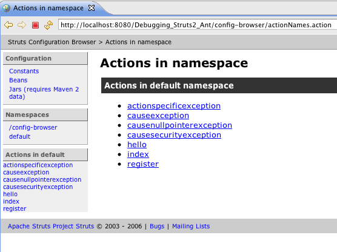
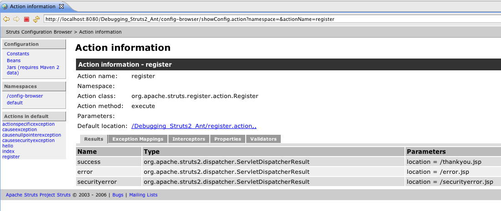
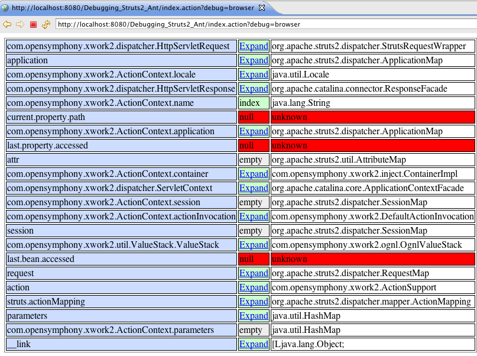

# Debugging Struts
{:.no_toc}

* Will be replaced with the ToC, excluding a header
{:toc}

The example code for this tutorial, **debugging_struts**, is available for checkout at [struts-examples](https://github.com/apache/struts-examples).

## Introduction

During development of a Struts 2 web application you may want to view the information being managed by the Struts 2 framework. 
This tutorial will cover two tools you can use to see how Struts 2 views your web application. One tool is the Struts 2 
configuration plugin and the other is the debugging interceptor. This article also discusses how to set the log level 
to see more or fewer log messages.

The Struts 2 [user mailing list](http://struts.apache.org/mail.html) is an excellent place to get help. If you are having 
a problem getting the tutorial example applications to work search the Struts 2 mailing list. If you don't find an answer 
to your problem, post a question on the mailing list.

## Configuration Plugin

The Struts 2 config browser plugin provides details about the configuration the Struts 2 framework is using to run your 
application. To use the plugin your application needs to have the struts2-config-browser-plugin-x.x.x.x.jar in your 
application's class path. The config-browser-plugin jar is part of the Struts 2 download and is also available in the Maven 
repository.

To use the plugin in your application, just call index.action in namespace `config-browser`. For example you could have 
the following link on your admin page (or just anywhere during your development).

```html
<a href='<s:url action="index" namespace="config-browser" />'>Launch the configuration browser</a>
```

In the example application, there is a link to the configuration browser on the index.jsp page.

Clicking on the link for the configuration browser will cause the Struts 2 framework to return this page to your browser.



You can click on an action link to see the configuration for that action. For example clicking on the register action 
link results in this.



You may then click on one of the tabs (Results, Exception Mappings, Interceptors, Properties, Validators) to get more 
information about how the Struts 2 framework is has configured that specific action.

On the left side of the page is the config browser plugin menu. Clicking on constants will render a view that lists all 
the Struts 2 constants and their properties for your application. Clicking on beans shows the beans Struts 2 is managing. 
Clicking on Jars shows the jars your application is using.

## Using the Debugging Interceptor

If you have set `devMode` to true (in the example application see `struts.xml`) then one of the interceptors that is 
activated when Struts 2 processes an action is the DebuggingInterceptor. The DebuggingInterceptor looks for a query 
string appended to the action URL with a name of debug and a value of xml, console, command, or browser.

If the `DebuggingInterceptor` finds that query string then it will halt further execution of the action and instead return 
to the browser debugging information. The format of the returned information depends on the value of the debug query parameter. 
See [DebuggingInterceptor](../core-developers/debugging-interceptor.html) for more detail.

In the example application on the index.jsp is a link for displaying debugging information. This link includes the query 
string `debug=browser`. If you click on this link you'll see a table with columns that can be expanded and collapsed. 
The table contains the various objects and their state being managed by the Struts 2 framework.



Note that to enable the correct display and interaction of the expand/collapse links on the debugging information web page 
you need to include the `s:head` tag in your JSP's head section (see index.jsp in the example application) and also include 
the Struts 2 dojo plugin in your application's class path. The Struts 2 dojo plugin is available as part of the Struts 2 
download and from the Maven repository.

## Struts 2 Logging

The Struts 2 framework will write to a log a great deal of information if you've configured the log properties to log at 
the debug level. In the example application, view `log4j2.xml`. The two major packages involved in the Struts 2 framework, 
`com.opensymphony` and `org.apache.struts2`, are configured to write debug and above log messages. When you run the application 
view the standard out for your Servlet container to see all the information written to the log. Please check [Logging](../core-developers/logging.html)
page for other options.

## Summary

Using the configuration browser plugin and the debugging interceptor can assist you in trouble shooting a problem with 
a Struts 2 web application. These tools should only be used in development.

Prior to creating your war file for deployment to production you should change `devMode` to false and remove the debugging 
links. You may also want to adjust the level of logging in your log properties file to a higher level (info or warn) to reduce 
the number of log messages.

|Return to [Exception handling](exception-handling.html)|or|onward to [Form tags](form-tags.html)|
