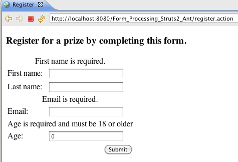
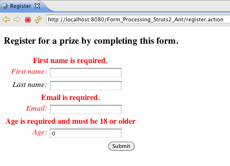

## Form Validation

This tutorial assumes you've completed the _Processing Forms_  tutorial and have a working form_processing project. The example code for this tutorial, form_validation, is available for checkout from the Struts 2 GitHub repository: [https://github.com/apache/struts-examples](https://github.com/apache/struts-examples).

> 

__Introduction__

In this tutorial we'll explore using Struts 2 to validate the user's input on a form. There are two ways you can use Struts 2 to do form validation. This tutorial will cover the more basic method, where the validation is included in the Struts 2 Action class.

| The [Struts 2 user mailing list](http://struts.apache.org/mail.html)^[http://struts.apache.org/mail.html] is an excellent place to get help. If you are having a problem getting the tutorial example applications to work search the Struts 2 mailing list. If you don't find an answer to your problem, post a question on the mailing list.

| 

__Add validate Method__

To enable the Struts 2 Action class to validate a user's input on a Struts 2 form, you must define a validate method in your Action class. Using the example from _Processing Forms_  tutorial, let's say that we have these business rules:

1. User must provide a first name
 2. User must provide an email address
 3. User younger then 18 cannot register

If you recall from the _Processing Forms_  tutorial the user's input into the form fields is placed by Struts 2 into the Java model class personBean. So a user's input into the firstName field would end up as the value for personBean's firstName instance field (via the personBean.setFirstName method).

In the validate method we can refer to get the values of personBean's instance fields by using the appropriate get methods. Once we have the values we can employ logic to enforce our business rules.

Add the following validate method to Register.java (the Action class).

**validate method**

~~~~~~~
	public void validate(){
		
		if ( personBean.getFirstName().length() == 0 ){	

			addFieldError( "personBean.firstName", "First name is required." );
			
		}
		
				
		if ( personBean.getEmail().length() == 0 ){	

			addFieldError( "personBean.email", "Email is required." );
			
		}
		
		if ( personBean.getAge() < 18 ){	

			addFieldError( "personBean.age", "Age is required and must be 18 or older" );
			
		}
		
		
	}

~~~~~~~

When the user presses the submit button on the register form, Struts 2 will transfer the user's input to the personBean's instance fields. Then Struts 2 will automatically execute the validate method. If any of the if statements are true, Struts 2 will call its addFieldError method (which our Action class inherited by extending ActionSupport).

If any errors have been added then Struts 2 will not proceed to call the execute method. Rather the Struts 2 framework will return "input" as the result of calling the action.

__Handle Input Being Returned__

So what should we do if Struts 2 returns "input" indicating that the user's input in the form is not valid? In most cases we will want to redisplay the web page that has the form and include in the form error messages to inform the user what is wrong.

To handle the return value of "input" we need to add the following result to our action node in struts.xml.

~~~~~~~
<result name="input">/register.jsp</result>

~~~~~~~

The above result node goes just after the success result node for the register action and before the closing of the action node.

__Error Messages__

So when validation fails and Struts 2 returns input, the Struts 2 framework will redisplay the register.jsp. Since we used Struts 2 form tags, automatically Struts 2 will add the error messages. These error messages are the ones we specified in the addFieldError method call. The addFieldError method takes two arguments. The first is the form field name to which the error applies and the second is the error message to display above that form field.

So the following addFieldError method call:

~~~~~~~
addFieldError( "personBean.firstName", "First name is required.")

~~~~~~~

will cause the message "First name is required" to be displayed above the firstName field on the form.

If you have made the above changes to the _Processing Forms_  tutorial or you have downloaded from [Google Code](http://code.google.com/p/struts2-examples/downloads/list)^[http://code.google.com/p/struts2-examples/downloads/list] either the Form_Validation_Struts2_Ant or Form_Validation_Struts2_Mvn projects run the application (see the README.txt in the project root folder). Click on the Please register link. On the registration form, just click the submit button and you should see:

Struts 2 called the validate method, validation failed, the register.jsp was displayed with the error messages.

__Styling The Error Messages__

The Struts 2 s:head tag can be used to provide CSS that includes a style for the error message. Add 

~~~~~~~
<s:head />
~~~~~~~
 to register.jsp before the closing HTML 

~~~~~~~
</head>
~~~~~~~
 tag. Go through the same steps as above and you should see:

__Summary__

This tutorial covered validating a user's form input by adding a validate method to an Action class. There is another more sophisticated way to validate user input using XML. If you want to learn more about using XML for validation in Struts 2 see _Validation_ .

__Up Next__

In our next tutorial we'll cover how to use message resource files to separate out the text from the view page.
