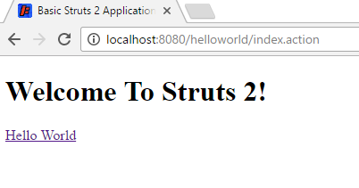
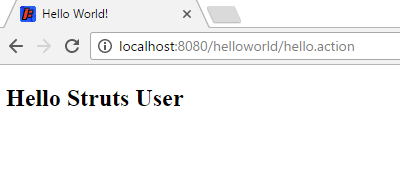

# Hello World Using Struts 2

When you click on a hyperlink or submit an HTML form in a Struts 2 web application, the input is not sent to another server page, but to a Java class that you provide. These classes are called Actions. After the Action fires, a Result selects a resource to render the response. The resource is generally a server page, but it can also be a PDF file, an Excel spreadsheet, or a Java applet window.

Suppose you want to create a simple "Hello World" example that displays a welcome message. After setting up an empty basic Struts 2 web application (see [How To Create A Struts 2 Web Application](how-to-create-a-struts2-web-application.html)), to create a "Hello World" example, you need to do four things:

1. Create a class to store the welcome message (the model)

2. Create a server page to present the message (the view)

3. Create an Action class to control the interaction between the user, the model, and the view (the controller)

4. Create a mapping (`struts.xml`) to couple the Action class and view

By creating these components, we are separating the work flow into three well-known concerns: the View, the Model, and the Controller. Separating concerns makes it easier to manage applications as they become more complex.

Let's look at an example model class, Action, server page, and mapping. If you like, fire up your Java IDE, and enter the code as we go.

> This tutorial assumes you've completed the [How To Create A Struts 2 Web Application](how-to-create-a-struts2-web-application.html) tutorial and have a working basic Struts project. The example code for this tutorial, helloworld, is available for checkout from the Struts 2 GitHub repository at [https://github.com/apache/struts-examples](https://github.com/apache/struts-examples). The example projects use Maven to manage the artifact dependencies and to build the .war files.

## The Code

Let's modify the basic-struts project to add the following: 

- a model class to store our message
- a view that displays our message
- an Action class to act as the controller
- a configuration that ties everything together

> The [Struts 2 user mailing list](http://struts.apache.org/mail.html) is an excellent place to get help. If you are having a problem getting this application to work search the Struts 2 mailing list. If you don't find an answer to your problem, post a question on the mailing list.

### Step 1 - Create The Model Class MessageStore.java

Create the `MessageStore` class in `src/main/java`. Be sure to note the package statement below.

> Note that in the code shown below the JavaDoc comments are omitted. In the download example, JavaDoc comments are included.

**MessageStore.java**

```java
package org.apache.struts.helloworld.model;

public class MessageStore {
    private String message;
    
    public MessageStore() {
        message = "Hello Struts User";
    }

    public String getMessage() {
        return message;
    }
}
```

Note the use of the public getter method to allow access to the private message String attribute. The Struts 2 framework requires that objects you want to expose to the view (`HelloWorld.jsp`) follow the [JavaBean-style conventions](http://en.wikipedia.org/wiki/JavaBean#JavaBean_conventions).

### Step 2 - Create The Action Class HelloWorldAction.java

We need an Action class to act as the Controller. The Action class responds to a user action (in this example that action will be clicking an HTML hyperlink and sending a specific URL to the Servlet container). One or more of the Action class's methods are executed and a String result is returned. Based on the value of the result, a specific view page (in this example that view page is `HelloWorld.jsp`) is rendered.

Note the package and import statements below.

**HelloWorldAction.java**

```java
package org.apache.struts.helloworld.action;

import org.apache.struts.helloworld.model.MessageStore;

import com.opensymphony.xwork2.ActionSupport;

public class HelloWorldAction extends ActionSupport {
    private MessageStore messageStore;

    public String execute() {
        messageStore = new MessageStore() ;
        
        return SUCCESS;
    }

    public MessageStore getMessageStore() {
        return messageStore;
    }
}
```

The Struts 2 framework will create an object of the `HelloWorldAction` class and call the execute method in response to a user's action (clicking on a hyperlink that sends a specific URL to the Servlet container).

In this example, the execute method creates an object of class `MessageStore` and then returns the String constant `SUCCESS`.

Note also the public getter method for the private `MessageStore` object. Since we want to make the `MessageStore` object available to the view page, `HelloWorld.jsp`, we need to follow the [JavaBean-style](http://en.wikipedia.org/wiki/JavaBean\#JavaBean_conventions) of providing getter and setter methods where needed.

### Step 3 - Create The View HelloWorld.jsp

We need a server page to present the message that is stored in the model class `MessageStore`. Create the below JSP in the `src/main/webapp` folder.

**HelloWorld.jsp**

```jsp
<!DOCTYPE html>
<%@ page language="java" contentType="text/html; charset=UTF-8" pageEncoding="UTF-8" %>
<%@ taglib prefix="s" uri="/struts-tags" %>
<html>
  <head>
    <meta http-equiv="Content-Type" content="text/html; charset=UTF-8">
    <title>Hello World!</title>
  </head>
  <body>
    <h2><s:property value="messageStore.message" /></h2>
  </body>
</html>
```

The taglib directive tells the Servlet container that this page will be using the Struts 2 tags and that these tags will be preceded by an `s`.

The `<s:property>` tag displays the value returned by calling the method `getMessageStore` of the `HelloWorldAction` controller class. That method returns a `MessageStore` object. By adding the `.message` onto the messageStore part of the value attribute we are telling the Struts 2 framework to call the `getMessage` method of that `MessageStore` object. The `getMessage` method of class `MessageStore` returns a String. It is that String that will be displayed by the `<s:property>` tag.

We'll learn more about tags in the next tutorial. See the _Struts Tags_  for more information about tags.

### Step 4 - Add The Struts Configuration In struts.xml

We need a mapping to tie the URL, the `HelloWorldAction` class (controller), and the `HelloWorld.jsp` (the view) together. The mapping tells the Struts 2 framework which class will respond to the user's action (the URL), which method of that class will be executed, and what view to render based on the String result that method returns.

Edit the `struts.xml` file (in the Mvn project that file is in the src/main/resources folder) to add the action mapping. Place the action node (action name="hello") between the opening and closing package node, just after the action mapping with the name="index". Your complete `struts.xml` should look like:

**struts.xml**

```xml
<?xml version="1.0" encoding="UTF-8"?>
<!DOCTYPE struts PUBLIC
		"-//Apache Software Foundation//DTD Struts Configuration 2.5//EN"
		"http://struts.apache.org/dtds/struts-2.5.dtd">
<struts>
    <constant name="struts.devMode" value="true" />

    <package name="basicstruts2" extends="struts-default">
        <action name="index">
            <result>/index.jsp</result>
        </action>
		
        <action name="hello" class="org.apache.struts.helloworld.action.HelloWorldAction" method="execute">
            <result name="success">/HelloWorld.jsp</result>
        </action>
    </package>
</struts>
```

### Step 5 - Create The URL Action

Let's add an Action URL inside `index.jsp` (see `src/main/webapp` folder) so the user can click on a link to tell the Struts 2 framework to run the execute method of the `HelloWorldAction` class and render the `HelloWorld.jsp` view.

First add the taglib directive at the top of the jsp `<%@ taglib prefix="s" uri="/struts-tags" %>`. Next add this p tag `<p><a href="<s:url action='hello'/>">Hello World</a></p>` after the h1 tag. Your new index.jsp should look like:

**index.jsp**

```jsp
<!DOCTYPE html>
<%@ page language="java" contentType="text/html; charset=UTF-8" pageEncoding="UTF-8" %>
<%@ taglib prefix="s" uri="/struts-tags" %>
<html>
    <head>
        <meta http-equiv="Content-Type" content="text/html; charset=UTF-8">
        <title>Basic Struts 2 Application - Welcome</title>
    </head>
    <body>
        <h1>Welcome To Struts 2!</h1>
        <p><a href="<s:url action='hello'/>">Hello World</a></p>
    </body>
</html>
```

The Struts url tag creates the URL with an action of hello. The hello action was mapped to the `HelloWorldAction` class and its `execute` method. When the user clicks on the above URL it will cause the Struts 2 framework to run the execute method of the `HelloWorldAction` class. After that method returns the String `success` (constant `SUCCESS`), the view page `HelloWorld.jsp` will be rendered.

### Step 6 - Build the WAR File and Run The Application

Execute `mvn jetty:run` to run the application.

Go to this URL [http://localhost:8080/helloworld/index.action](http://localhost:8080/helloworld/index.action) where you should see the following:



Click on the Hello World link and you should get the HelloWorld.jsp page:



## How the Code Works

Your browser sends to the web server a request for the URL [http://localhost:8080/helloworld/hello.action](http://localhost:8080/helloworld/hello.action).

1. The container receives from the web server a request for the resource `hello.action`. According to the settings loaded from the [web.xml](//struts.apache.org/docs/webxml.html) , the container finds that all requests are being routed to `org.apache.struts2.dispatcher.filter.StrutsPrepareAndExecuteFilter`, including the `*.action` requests. The StrutsPrepareAndExecuteFilter is the entry point into the framework.

2. The framework looks for an action mapping named "hello", and it finds that this mapping corresponds to the class "HelloWorldAction". The framework instantiates the Action and calls the Action's `execute` method.

3. The `execute` method creates the MessageStore object and returns `SUCCESS` (=`"success"`). The framework checks the action mapping to see what page to load if `SUCCESS` is returned. The framework tells the container to render as the response to the request, the resource `HelloWorld.jsp`.

4. As the page `HelloWorld.jsp` is being processed, the `<s:property value="messageStore.message" />` tag calls the getter `getMessageStore` of the `HelloWorld` Action and then calls the `getMessage` of the MessageStore object returned by `getMessageStore`. The tag merges the value of the message attribute into the response.

5. A pure HTML response is sent back to the browser.

## What to Remember

The framework uses Actions to process HTML forms and other requests. The `Action` class returns a result-name such as `SUCCESS`, `ERROR` or `INPUT`. Based on the mappings loaded from the `struts.xml`, a given result-name may select a page (as in this example), another action, or some other web resource (image, PDF).

When a server page is rendered, most often it will include dynamic data provided by the Action. To make it easy to display dynamic data, the framework provides a set of tags that can be used along with HTML markup to create a server page.

|Return to [How to create a Struts 2 web application](how-to-create-a-struts2-web-application.html)|or|onward to [Using Struts 2 Tags](using-tags.html)|
