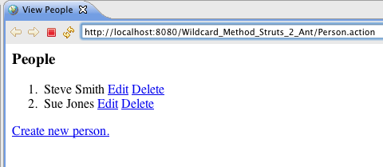

## Wildcard Method Selection

The example code for this tutorial, wildcard_method_selection, is available for checkout at [https://github.com/apache/struts-examples](https://github.com/apache/struts-examples)

__Introduction__

In this tutorial we'll cover how to configure an action node in the struts.xml configuration file so that one action node can be used to relate several different Action URLs to specific methods of the Action class. This will reduce the number of action nodes we must write in the struts.xml configuration file.

The [Struts 2 user mailing list](http://struts.apache.org/mail.html) is an excellent place to get help. If you are having a problem getting the tutorial example applications to work search the Struts 2 mailing list. If you don't find an answer to your problem, post a question on the mailing list.

__Example Application__



The example application that supports this tutorial shows how to use Struts 2's wildcard method selection methodology. The example application is just a simple one that lists some people and lets you edit them, delete them, and add a new person to the list. Everything that the application needs to do with a `Person` (the model class) is controlled by the Struts 2 `ActionSupport` class `PersonAction`. The `PersonAction` class has several different methods (e.g. create, edit, delete) that are called depending on what the user wants to do.

__Wildcard Method Selection__

Without using the wildcard method selection technique, I'd have to write an action mapping node in the Struts 2 configuration file for each separate action I'd want to call. For example:

**Struts.xml Action Configuration**

```xml
<action name="createPerson" class="org.apache.struts.tutorials.wildcardmethod.action.PersonAction" method="create">
    <result name="input">input.jsp</result>
    <result name="success">view.jsp</result>
</action>

<action name="editPerson" class="org.apache.struts.tutorials.wildcardmethod.action.PersonAction" method="edit">
    <result name="input">input.jsp</result>
    <result name="success">view.jsp</result>
</action>
```

So even for this simple application, I'd have to write four separate action mapping nodes (create, edit, delete, saveOrUpdate) in the configuration file. So you can easily see that a more complex application can have dozens of action mapping nodes.

To implement the wildcard method selection technique to enable the Struts 2 framework to dynamically select the correct method to call at runtime you just need to use the wildcard character, *, in your name value and an attribute value place holder ( `{1}` ) for the method value. For example:

**Struts.xml Action Configuration Using Wildcard Method Selection**

```xml
<action name="*Person" class="org.apache.struts.tutorials.wildcardmethod.action.PersonAction" method="{1}">
    <result name="success">view.jsp</result>
    <result name="input">input.jsp</result>
</action>
```

The `*` is the wildcard character. Any action name values that end in "Person" will be handled by this action mapping. Whatever value is before "Person" will be the value used for the method attribute (the `{1}` place holder will be replaced with that value). For example this URL:

[http://localhost:8080/wildcard-method-selection/createPerson.action](http://localhost:8080/wildcard-method-selection/createPerson.action)

will be be processed by the the above action mapping and method create of class PersonAction will be called. While this URL

[http://localhost:8080/wildcard-method-selection/deletePerson.action](http://localhost:8080/wildcard-method-selection/deletePerson.action)

will cause the delete method of class `PersonAction` to be called.

What happens if we have a URL with nothing in front of Person? For example:

[http://localhost:8080/wildcard-method-selection/Person.action](http://localhost:8080/wildcard-method-selection/Person.action)

If there is no value in front of Person, then the Struts 2 framework will call the execute method of the class `PersonAction`.

__Dynamic Method Invocation__

The wildcard method selection technique explained above should not be confused with the "Dynamic Method Invocation" technique. The Struts 2 documentation explains this technique (which uses the bang, `!`, operator in the action name) and recommends against using the "Dynamic Method Invocation" technique due to security and other reasons related to how this technique is implemented internally.

The Struts 2 documentation also recommends turning off the option to use the dynamic method invocation by setting `struts.enable.DynamicMethodInvocation` to `FALSE` in the Struts configuration.

__Summary__

By using the wildcard method selection technique explained above, you can significantly reduce the number of action mapping nodes you need to write and manage in the Struts 2 XML configuration file.

|Return to [Form validation using XML](form-validation-using-xml.html)|or|onward to [Themes](themes.html)|
